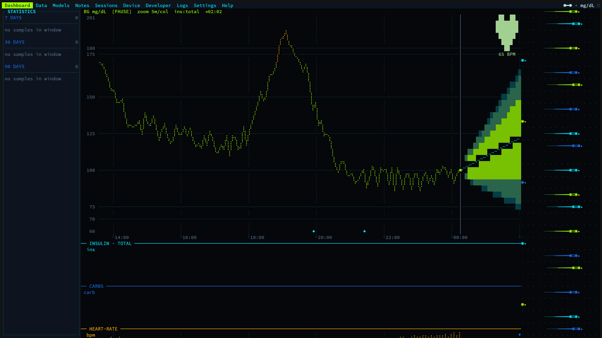
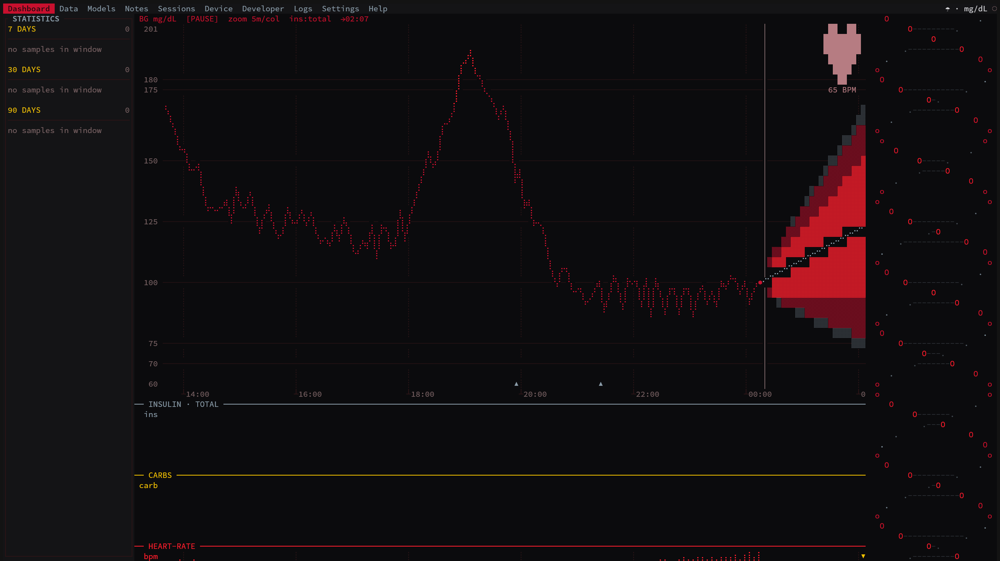

# T1DMSERVER

A single-user Type 1 Diabetes telemetry appliance. One binary is both an
HTTP/WebSocket server and a live terminal dashboard, backed by an in-process
SQLite store — built to run unattended on a Raspberry Pi Zero 2 W and be watched
from a tmux session over SSH.

The companion phone app is authoritative: it authors every record and computes
every forecast and statistic. The server stores what it is given verbatim and
fans it out to read-only viewers, interpreting nothing, recomputing nothing, and
never re-stamping a client's timestamps.

> [!CAUTION]
> **Research and educational use only.** A personal telemetry store and dashboard
> for Type 1 Diabetes data — not a medical device, not clinically validated. The
> forecasts and statistics it holds are informational and **must not** be used
> for medical, diagnostic, treatment, or insulin-dosing decisions, nor to guide
> diabetes management in any way; for medical advice consult a qualified
> healthcare professional. Provided "as is", without warranty; the authors accept
> no liability.

## Gallery

*Dashboard with the Tron Legacy theme.*



*Dashboard with the Umbrella Corp theme.*



## Features

- **Scalar grid.** Blood glucose, heart rate, steps, sleep, exercise, and mood
  share one SQLite table on a fixed five-minute epoch grid; gaps are explicit
  `NULL`s. Glucose is stored in mg/dL and displayed in mg/dL, mmol/L, or
  Kovatchev risk space.
- **Curve events.** Meals, doses, basal schedules, and prediction curves are
  keyed by a phone-minted `client_id` and upserted idempotently against the
  client's own `updated_at`.
- **Real-time fan-out.** A WebSocket pushes every stored record as tagged JSON to
  all connected clients except the one that wrote it.
- **Model registry.** Files dropped into the models directory are scanned,
  hashed, and served over HTTP alongside their opaque metadata.
- **Themed terminal UI.** Four hot-swappable themes — Tron Legacy, Umbrella
  Corp, Hello Kitty, Windows XP — over a demand-driven renderer that reflows
  from a wide multi-pane view down to a single-column Termux layout.

## Architecture

A four-worker Tokio runtime serves the axum router and watches the models
directory; the ratatui TUI owns the main thread. SQLite runs in WAL mode, with
every write serialized behind one mutex and reads served from an r2d2 pool.
Stored records reach the TUI over an in-process broadcast channel, so the
dashboard updates without polling.

| Crate | Responsibility |
| --- | --- |
| `crates/core` | Domain types, units, curve maths, config |
| `crates/store` | Schema, serialized writer and read pool, CRUD, tokens and sessions, model registry |
| `crates/api` | axum router, bearer-auth extractors, REST handlers, WebSocket hub |
| `crates/tui` | Layout tree, panes, widgets, themes, animation, boot sequences |

## Build and run

Rust 1.96, edition 2021.

```
cargo build --release      # native — the canonical compile gate
just build-pi              # aarch64 for the Pi, via `cross`
t1dmserver [CONFIG_PATH]   # defaults to ./config.toml
```

`cross` supplies the aarch64 C toolchain that `rusqlite`'s bundled SQLite needs.
Without it, add the `aarch64-unknown-linux-gnu` target and an `aarch64-linux-gnu`
GCC, then point `CARGO_TARGET_AARCH64_UNKNOWN_LINUX_GNU_LINKER` and
`CC_aarch64_unknown_linux_gnu` at that compiler.

One invocation launches both the server and the TUI, which owns the terminal for
its lifetime: `Tab` cycles panes, `t` cycles themes, `h` or `?` opens help, `q`
quits. Over SSH it belongs in tmux, which the TUI expects to offer truecolor and
mouse support (`set -ga terminal-overrides ",*:RGB"` and `set -g mouse on`).

## Configuration

A TOML file, taken from the first command-line argument or `./config.toml`. Every
key has a default, so an absent or unparseable file yields a fully-defaulted
configuration.

| Key | Default | Meaning |
| --- | --- | --- |
| `server.bind` | `"0.0.0.0"` | Interface the server binds |
| `server.port` | `8443` | Listen port |
| `storage.data_dir` | `"./data"` | Root holding `t1dm.db`, `models/`, `photos/`, `backups/` |
| `qr.advertise_addr` | `"100.64.0.1"` | Address embedded in the login QR |
| `qr.advertise_port` | `8443` | Port embedded in the login QR |
| `ui.theme` | `"tron"` | `tron`, `umbrella`, `hellokitty`, or `winxp` |
| `ui.fps` | `60` | Frame-rate ceiling (a cap, not a target) |
| `ui.show_boot` | `true` | Play the theme boot sequence on launch |
| `ui.bg_unit` | `"mgdl"` | Display unit: `mgdl`, `mmol`, or `kovachev` |
| `log.level` | `"info"` | `error`, `warn`, `info`, `debug`, or `trace` |

The `qr.advertise_*` values are what a client should dial, which may differ from
the bind address — a Tailscale address, for example. Database backups are taken
on demand from the Settings pane into `<data_dir>/backups`.

## Access

Access is governed by opaque bearer tokens: 32 random bytes rendered as hex,
stored only as a salted SHA-256 verifier, never expiring, revocable. At most one
`rw` token exists at a time — minting a new one replaces the previous — and each
viewing device gets its own `ro` token. They are minted only from the TUI's
Sessions pane, so first light requires terminal access: start the binary, open
Sessions, mint the `rw` token, and scan the QR it renders to enrol the phone.

> [!WARNING]
> Plain HTTP, permissive CORS, and tokens that never expire: this is a private
> appliance for a tailnet or LAN, and should not be exposed to the open internet.

## API

The REST and WebSocket contract — every endpoint, its authentication
requirement, request and response shapes, event schemas, and the error format —
is specified once for the whole suite in
[T1DMCOMMON](https://github.com/0xdeadf1sh/T1DMCOMMON).
[`docs/API.md`](docs/API.md) maps it onto this codebase.

## Related projects

- **[T1DMSIM](https://github.com/0xdeadf1sh/T1DMSIM)** — the behavioral
  simulator whose synthetic traces pretrain the forecasting model.
- **[T1DMAI](https://github.com/0xdeadf1sh/T1DMAI)** — the training and
  ExecuTorch export pipeline that produces the artifacts this server's model
  registry distributes.
- **[T1DMDROID](https://github.com/0xdeadf1sh/T1DMDROID)** — the Android app
  that reads the CGM, runs inference on device, and is the authoritative
  read/write client here.

## License

Released under the [MIT License](LICENSE).
